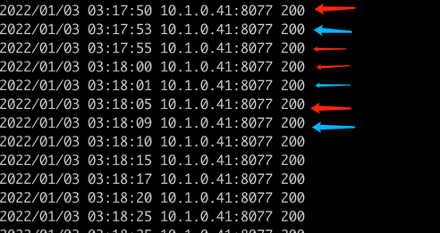

# httpserver

## 模块二作业

### 作业内容

1. 接收客户端request，并将request中带的header写入response header
2. 读取当前系统的环境变量中的VERSION配置，并写入response header
3. Server端记录访问日志包括客户端IP，HTTP返回码，输出到server端的标准输出
4. 当访问localhost/healthz时，应返回200

### 编译方式

```shell
# 默认OS=linux ARCH=amd64
make build

# 针对其他系统架构，可在命令行中自定义
make build OS=darwin ARCH=arm64
```

### 运行方式

```shell
./bin/amd64/httpserver
```

## 模块三作业

### 作业内容

1. 构建本地镜像。
2. 编写 Dockerfile 将练习 2.2 编写的 httpserver 容器化（请思考有哪些最佳实践可以引入到 Dockerfile 中来）。
3. 将镜像推送至 Docker 官方镜像仓库。
4. 通过 Docker 命令本地启动 httpserver。
5. 通过 nsenter 进入容器查看 IP 配置。

### 制作docker镜像

```shell
# 默认TAG为1.0.0 可通过命令行自定义
make release TAG=1.0.0
```

### 推送docker镜像到官方仓库

```shell
make push
```

### 通过docker本地启动httpserver

```shell
docker run --name httpserver -d chkinglee/httpserver:1.0.0 -p 8077:8077
```

### 访问

```shell
curl 127.0.0.1:8077/healthz
# you will see it:
# I am running
```

## 模块八作业

### 作业内容

编写Kubernetes部署脚本将httpserver部署到kubernetes集群，以下是你可以思考的维度

1. 优雅启动
2. 优雅终止
3. 资源需求和QoS保证
4. 探活
5. 日常运维需求，日志等级
6. 配置和代码分离

在第一部分的基础上提供更加完备的部署spec，包括（不限于）

1. Service
2. Ingress

可以考虑的细节

1. 如何确保整个应用的高可用
2. 如何通过证书保证httpServer的通讯安全

> 以下shell命令示例中，使用了```alias k=kubectl```

### 部署ingress-nginx

```shell
kubectl apply -f https://raw.githubusercontent.com/kubernetes/ingress-nginx/controller-v1.1.0/deploy/static/provider/baremetal/deploy.yaml
```

```shell
chkinglee@localhost:~/coding/github/chkinglee/geektime/cloud_native_training_camp/04/httpserver$ k get pod -n ingress-nginx -o wide
NAME                                        READY   STATUS      RESTARTS   AGE   IP          NODE             NOMINATED NODE   READINESS GATES
ingress-nginx-admission-create--1-949l2     0/1     Completed   0          10s   10.1.0.38   docker-desktop   <none>           <none>
ingress-nginx-admission-patch--1-znt6m      0/1     Completed   1          10s   10.1.0.39   docker-desktop   <none>           <none>
ingress-nginx-controller-5fd866c9b6-hlgcv   0/1     Running     0          10s   10.1.0.40   docker-desktop   <none>           <none>
chkinglee@localhost:~/coding/github/chkinglee/geektime/cloud_native_training_camp/04/httpserver$ k get svc -n ingress-nginx
NAME                                 TYPE        CLUSTER-IP       EXTERNAL-IP   PORT(S)                      AGE
ingress-nginx-controller             NodePort    10.105.255.132   <none>        80:32290/TCP,443:32506/TCP   18s
ingress-nginx-controller-admission   ClusterIP   10.99.15.140     <none>        443/TCP                      18s
```

因ingress-nginx的svc以NodePort方式创建，可以直接通过localhost:<NodePort>来访问ingress-nginx

```shell
chkinglee@localhost:~/coding/github/chkinglee/geektime/cloud_native_training_camp/04/httpserver$ curl localhost:32290
<html>
<head><title>404 Not Found</title></head>
<body>
<center><h1>404 Not Found</h1></center>
<hr><center>nginx</center>
</body>
</html>
```

### 部署httpserver的namespace，带deploy和svc

```shell
kubectl apply -f httpserver-deploy.yml
```

```shell
chkinglee@localhost:~/coding/github/chkinglee/geektime/cloud_native_training_camp/04/httpserver$ k apply -f httpserver-deploy.yml
namespace/httpserver created
deployment.apps/httpserver created
service/httpserver created
chkinglee@localhost:~/coding/github/chkinglee/geektime/cloud_native_training_camp/04/httpserver$ k get pod -n httpserver -o wide
NAME                         READY   STATUS    RESTARTS   AGE   IP          NODE             NOMINATED NODE   READINESS GATES
httpserver-55c697d8d-fw8zz   1/1     Running   0          24s   10.1.0.37   docker-desktop   <none>           <none>
httpserver-55c697d8d-x5lh4   1/1     Running   0          24s   10.1.0.36   docker-desktop   <none>           <none>
chkinglee@localhost:~/coding/github/chkinglee/geektime/cloud_native_training_camp/04/httpserver$ k get svc -n httpserver
NAME         TYPE        CLUSTER-IP    EXTERNAL-IP   PORT(S)    AGE
httpserver   ClusterIP   10.96.90.33   <none>        8088/TCP   30s
```

### 部署httpserver的ingress

```shell
kubectl apply -f httpserver-ingress.yml
```

```shell
chkinglee@localhost:~/coding/github/chkinglee/geektime/cloud_native_training_camp/04/httpserver$ k apply -f httpserver-ingress.yml
ingress.networking.k8s.io/httpserver created
chkinglee@localhost:~/coding/github/chkinglee/geektime/cloud_native_training_camp/04/httpserver$ k get ingress -n httpserver
NAME         CLASS   HOSTS          ADDRESS   PORTS   AGE
httpserver   nginx   chkinglee.me             80      21s
chkinglee@localhost:~/coding/github/chkinglee/geektime/cloud_native_training_camp/04/httpserver$ k describe ingress httpserver -n httpserver
Name:             httpserver
Namespace:        httpserver
Address:
Default backend:  default-http-backend:80 (<error: endpoints "default-http-backend" not found>)
Rules:
  Host          Path  Backends
  ----          ----  --------
  chkinglee.me
                /httpserver/(.+)   httpserver:8088 (10.1.0.36:8077,10.1.0.37:8077)
Annotations:    nginx.ingress.kubernetes.io/rewrite-target: /$1
Events:
  Type    Reason  Age   From                      Message
  ----    ------  ----  ----                      -------
  Normal  Sync    47s   nginx-ingress-controller  Scheduled for sync
chkinglee@localhost:~/coding/github/chkinglee/geektime/cloud_native_training_camp/04/httpserver$ curl -sH 'Host:chkinglee.me' http://127.0.0.1:32290/httpserver/healthz
I am running
```

### 优雅启动和优雅终止

```yaml
          lifecycle:
            postStart: # 优雅启动
              exec:
                command: [ "/bin/sh", "-c", "echo postStart. HTTPSERVER >/proc/1/fd/1" ]
            preStop: # 优雅终止
              exec:
                command: [ "/bin/sh", "-c", "echo preSop. HTTPSERVER >/proc/1/fd/1 && sleep 60" ]
```


### 探活

```yaml
          livenessProbe: # 探活
            httpGet:
              path: /healthz
              port: 8077
              scheme: HTTP
            initialDelaySeconds: 10
            periodSeconds: 8
            successThreshold: 1
            timeoutSeconds: 1
            failureThreshold: 3
          readinessProbe: # 就绪状态检查
            httpGet:
              path: /healthz
              port: 8077
              scheme: HTTP
            initialDelaySeconds: 10
            periodSeconds: 5
            successThreshold: 1
            timeoutSeconds: 1
            failureThreshold: 3
```

每隔5秒1次readiness探活

每隔8秒1次liveness探活



### 资源限制和QoS

```yaml
          resources: # 资源限制
            limits:
              cpu: 200m
              memory: 100Mi
            requests:
              cpu: 200m
              memory: 100Mi
```

查询QoS级别

```shell
kubectl describe pod <pod> -n httpserver
```


### 配置与代码分离

> 简单应用了env，对应模块二作业2. 读取当前系统的环境变量中的VERSION配置，并写入response header

```yaml
          env:
            - name: VERSION
              value: 1.0.1-a
```

```shell
chkinglee@localhost:~/coding/github/chkinglee/geektime/cloud_native_training_camp/04/httpserver$ curl -I -H 'Host:chkinglee.me' http://127.0.0.1:32290/httpserver/healthz
HTTP/1.1 200 OK
......
Version: 1.0.1-a
......
```

### 使用makefile一键部署&销毁

```shell
# 部署
make deploy

# 销毁
make destroy
```

```shell
chkinglee@localhost:~/coding/github/chkinglee/geektime/cloud_native_training_camp/04/httpserver$ make destroy
delete httpserver namespace
kubectl delete ns httpserver
namespace "httpserver" deleted
chkinglee@localhost:~/coding/github/chkinglee/geektime/cloud_native_training_camp/04/httpserver$ make deploy
deploying httpserver locally with kubernetes
kubectl apply -f httpserver-deploy.yml
namespace/httpserver created
deployment.apps/httpserver created
service/httpserver created
kubectl apply -f httpserver-ingress.yml
ingress.networking.k8s.io/httpserver created
```